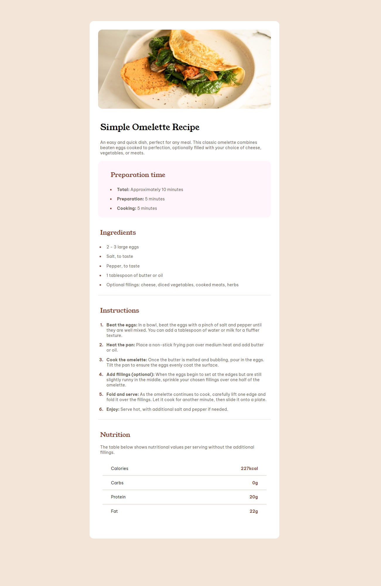
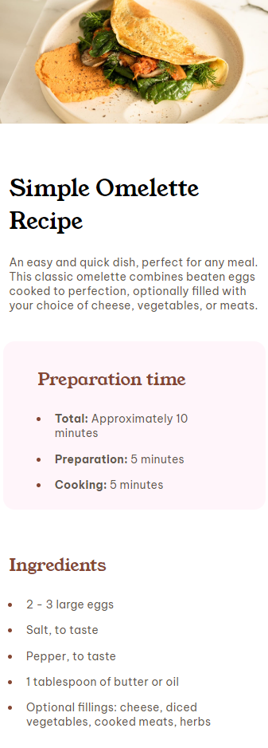

# Frontend Mentor - Recipe page solution

This is a solution to the [Recipe page challenge on Frontend Mentor](https://www.frontendmentor.io/challenges/recipe-page-KiTsR8QQKm). Frontend Mentor challenges help you improve your coding skills by building realistic projects. 

## Table of contents

- [Overview](#overview)
  - [The challenge](#the-challenge)
  - [Screenshot](#screenshot)
  - [Links](#links)
- [My process](#my-process)
  - [Built with](#built-with)
  - [What I learned](#what-i-learned)
  - [Continued development](#continued-development)
- [Author](#author)

## Overview

### Screenshot

### Links

- Solution URL: [Solution Recipe Page]([https://your-solution-url.com](https://github.com/ioangheraszim/recipe-page/)
- Live Site URL: [Recipe Page]([https://your-live-site-url.com](https://ioangheraszim.github.io/recipe-page/))

## My process

Started project by setting up my files and diving into the design. Following it closely, I have broken down the design into distinct components piecing them together to create the whole design. Afterwords, I have applying the styling accordingly.

### Built with

- Semantic HTML5 markup
- CSS custom properties
- Flexbox
- CSS Grid
- Mobile-first workflow

### What I learned

This project has been a fantastic chance for me to dive back into familiar territory and brush up on skills I've already mastered. It's provided a hands-on opportunity to practice and refine my existing knowledge in a comfortable and enjoyable way.

### Continued development

Will study up on more concepts regarding CSS styling, JavaScript programming and React.js library.

## Author

- Website - [mreone.dev](https://ioangheraszim.github.io/portofolio/)
- Frontend Mentor - [@ioangheraszim](https://www.frontendmentor.io/profile/ioangheraszim)

